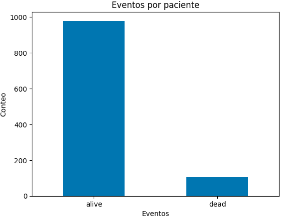
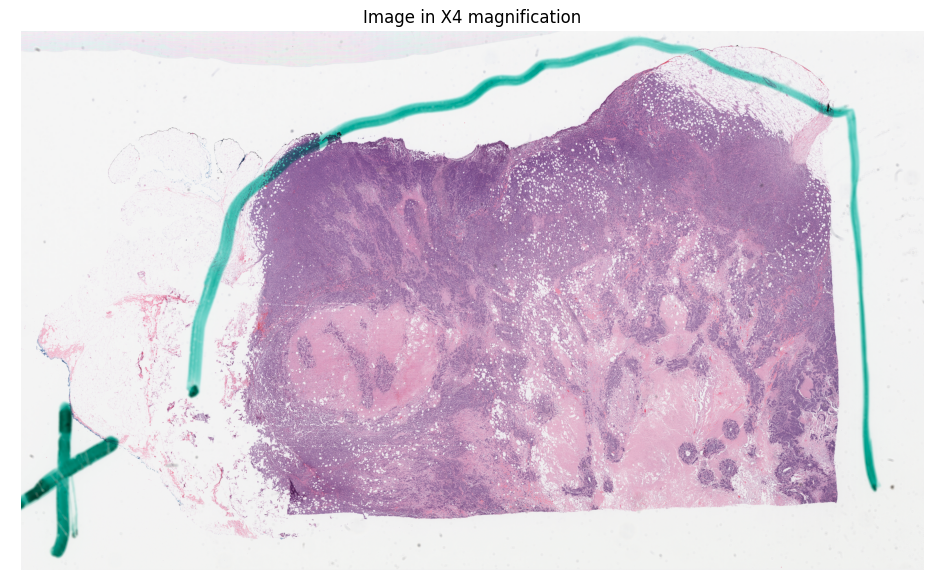
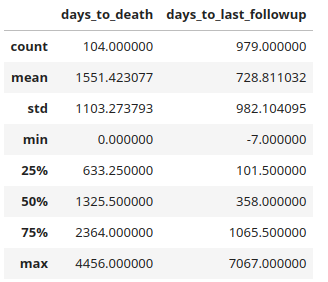
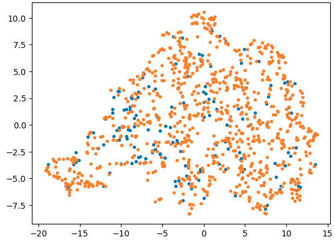

# Reporte de Datos

## Resumen general de los datos

En general, el conjunto de datos está compuesto por tres factores: 
    * WSI: imágenes de patología
    * time: tiempo hasta el evento 
    * event: evento presentado.

En total, el conjunto de datos cuenta con 1062 pacientes, sin embargo, de estos solo 1038 cuentan con todos los registros completos. 

En la imagen se visualiza el balance entre los eventos reportados dentro del conjunto de datos.

## Resumen de calidad de los datos

En general, la cálida de los datos es bastante reducida, pues si bien el 98 % del dataset es utilizable, se denotan bastante imagen que contiene artefactos por la toma de la muestra. Algunos ejemplos:

## Variable objetivo

La variable objetivo es el tiempo hasta el evento, el cual depende del evento presentado, por lo cual se muestran las distribuciones para cada clase:

## Relación entre variables explicativas y variable objetivo

Utilizando el backbone de una efficientNetV2 preentrenada se establece la representación de cada imagen, seguidamente se utiliza para observar la distribución de los datos de entrada respecto a la salida.

En la imagen se observa la distribución conforme al evento presentado (azul: muerte, naranja: cura). Se identifica una baja separabilidad de los datos, lo que denota la necesidad de reajustar la red para favorecer una mejora en el desempeño durante el entrenamiento. 